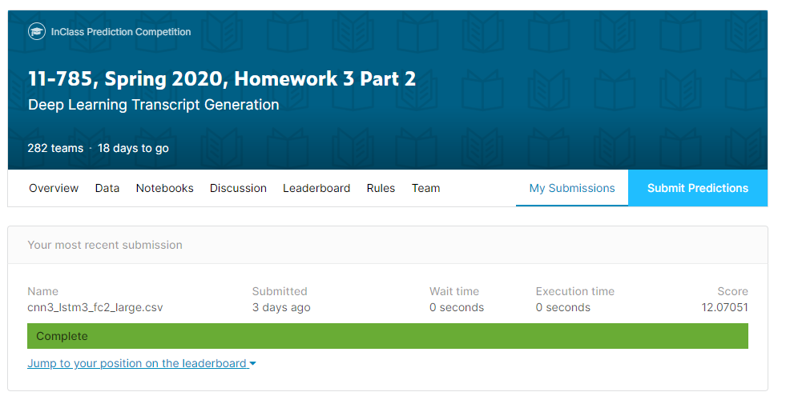

# Deep Learning Kaggle
Some competitions in kaggle related to Deep Learning written in PyTorch.

### 1. Frame-level Classification of Speech
https://www.kaggle.com/c/11-785-s20-hw1p2  
In this _Audio Phoneme Recognition challenge_ I take my knowledge of feedforward neural networks and apply it to speech recognition. I am provided a dataset of audio recordings (utterances) and their phoneme state (subphoneme) labels. The data comes from articles published in the Wall Street Journal (WSJ) that are read aloud and labelled using the original text.  
My job is to identify the phoneme state label for each frame in the test data set.  
This work is not allowed to use RNN or CNN, so I use barely multi-layer neural networks to train the model in PyTorch.
My accuracy is 0.61.  
  
  
### 2. Deep Learning Face Recognition
https://www.kaggle.com/c/11-785-s20-hw2p2-classification/  
https://www.kaggle.com/c/11-785-s20-hw2p2-verification/  
Given an image of a person’s face, the task of classifying the ID of the face is known as face classification. The input is a face image to predict the ID of the face. The ground truth will be present in the training data and the network will be doing an N-way classification to get the prediction.  
The problem of determining whether two face images are of the same person is known as face verification. The input will be a pair of face images that may or may not belong to the same person. The goal is to output a numeric score that quantifies how similar the faces in the two images are. A higher score will indicate higher confidence that the faces in the two images are of the same person.   
I built a customized dataloader and a model based on _resnet50_ to implement this _Low Resolution Facial Recognition_ in PyTorch.  
The classification score is 0.70 and the verification score is 0.84.  
  
  

### 3. Deep Learning Transcript Generation
https://www.kaggle.com/c/11-785-s20-hw3p2  
This challenge is also _Audio Phoneme Recognition_ challenge. The WSJ dataset is used. The labels are unaligned. That means the list of phonemes for each utterance is not which frames correspond to which phonemes. Inference of the alignment uses _CTC loss_.
I built a customized dataloader and a model based on _CNN_ and _GRU_ to implement this _Audio Phoneme Recognition_ in PyTorch.  
The score is 12.  
 

